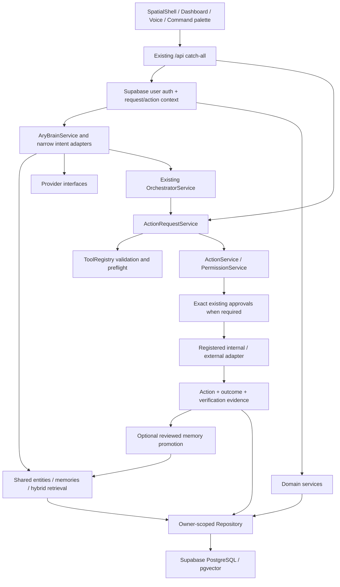

> Historical snapshot, superseded by [the current audit](../nexus-current-state.md). Statements below describe September 8, not the current repository.

# ARY Nexus — current-state repository audit

**Audit date:** September 8, 2026. **Stage:** repository audit and baseline only; no feature implementation or application refactor.

[ARY_NEXUS_ROADMAP.md](../ARY_NEXUS_ROADMAP.md) remains the canonical status/order document. This file maps implementation and debt; it is not a second roadmap. Preserve everything already working. “Implemented,” “fixture-tested,” “live-tested,” and “deployed” are different claims throughout this audit.

## 1. Executive assessment

Ary Nexus already has a substantial, integrated intelligence system: persistent memory with provenance/versioning, canonical entity resolution, hybrid retrieval, shared-context reasoning, reviewed actions, transactional internal tasks/projects, approvals, audit/outcomes, voice, graph visualization, advisory roles and bounded multi-tool coordination. These foundations should be kept. There is no evidence justifying a replacement brain, store, permission model or graph renderer.

The actual frontend is a CSS 3D orbital shell surrounding a large client-side workspace. Brain Graph interaction is **Canvas2D**, enhanced by optional **vgpu/WebGPU** effects. **XYFlow, Three.js, GSAP, Rive, Mem0, Graphiti, LangGraph and LiveKit are not runtime dependencies.** The five reference repositories have review/provenance notes under `references/`; their applications were not imported. Do not change working code to make older prompts' library names true.

Highest-priority architectural debt is operational: no Git commit baseline in this checkout, request/host-dependent background work, single-host file vaults/locks, unbounded tenant-history materialization, and unfinished live-provider/device acceptance. Highest-priority UI debt is composition: mixed light/dark styles, a large Dashboard, duplicated navigation metadata, technical JSON review surfaces and incomplete physical/accessibility validation.

Fresh baseline: **907 TypeScript-suite tests passed across 57 files; 12 separate Python adapter tests passed; production build and formatting passed. Standalone typecheck FAILED on two identical duplicate generated declaration files.** The build's own TypeScript phase passed. Both results are retained; no source fix or generated-file cleanup was performed to manufacture an all-green audit.

## 2. Scope, method and repository identity

Inspected `AGENTS.md`, the roadmap, package/lock/config files, source inventory and composition roots, domain/service/repository contracts, API branches, migrations, frontend navigation/styles/visual layers, voice lifecycles, provider/tool adapters, desktop/native bridges, test inventory and relevant milestone reports. Consumer searches checked suspected legacy graph exports; searches mapped streams, polling, WebSockets, auth, permission boundaries and background-job scheduling.

This is a comprehensive architecture/component audit, not a line-by-line security certification, dependency vulnerability scan, production load test, fresh device inventory or live Supabase catalog audit. No live provider acceptance scripts, account creation, device control, camera capture, paid model evaluation or external messaging was performed. Ignored credential values were not read or printed; environment configuration statements in older reports remain dated evidence rather than fresh validation. UI observations here are source-based; this stage did not add a new browser/device acceptance run.

| Repository/build fact | Observed value                                                                                                                                                                                                           |
| --------------------- | ------------------------------------------------------------------------------------------------------------------------------------------------------------------------------------------------------------------------ |
| Repository            | `ary-nexus` within the existing QACutter workspace; package `ary-nexus@0.1.0`                                                                                                                                            |
| Git state             | Branch `main` has **no commits**; `git ls-files` returns **0 tracked files**. Existing project files are untracked. No commit SHA can identify this baseline. Remote GitHub contents/deployment parity were not checked. |
| Runtime used          | Node **v26.7.0**, macOS arm64; package requires Node `>=22`                                                                                                                                                              |
| Lockfile versions     | Next **16.3.4**, React **19.2.8**, TypeScript **5.9.3**, Vitest **3.2.7**, Electron **44.2.0**, vgpu **0.4.0**, MediaPipe Tasks Vision **1.0.1**                                                                         |
| App routes            | `/`, `/_not-found`, dynamic `/api/[...path]`; no separate page routes for individual workspace modules                                                                                                                   |
| Database artifacts    | 13 migrations, deployment baseline JSON, Supabase config; no migration applied in this audit                                                                                                                             |
| Build/deploy tooling  | npm scripts, lockfile, Electron build/launcher; no repository CI workflow or signed remote-updater implementation found                                                                                                  |
| Preservation check    | SHA-256 manifest of **339 source/config/test/script/native-plugin files** recorded before the audit; all unchanged at final verification. Generated `.next` outputs are build artifacts, excluded from this comparison.  |

## 3. Classification legend and component map

Each row has one primary disposition. **KEEP** means preserve the working implementation, not certify every future use. **REFACTOR** means retain behavior/interfaces and consider a bounded internal improvement later; no refactor is authorized by this report. **INCOMPLETE** includes a implemented foundation whose stated live/production scope remains unverified. **DEPRECATED** identifies an obsolete/unconsumed path for future review, not permission to delete it. **REPLACE** is reserved for an implementation that should be superseded; **none is justified in the present authorized scope**. A future managed vault or packaged release must preserve existing interfaces and receive its own acceptance work.

### Frontend, design, navigation and visual systems

| Component                            | Class      | Current implementation / evidence                                                                                                                                                                                                | Boundary or remaining work                                                                                                                                                                             |
| ------------------------------------ | ---------- | -------------------------------------------------------------------------------------------------------------------------------------------------------------------------------------------------------------------------------- | ------------------------------------------------------------------------------------------------------------------------------------------------------------------------------------------------------ |
| Next App Router entry/layout         | KEEP       | [`src/app/page.tsx`](../src/app/page.tsx), `layout.tsx`: root renders SpatialShell; metadata and global stylesheet in layout.                                                                                                    | Server entry is thin; authentication and workspace rendering happen client-side.                                                                                                                       |
| Dashboard composition                | REFACTOR   | [`src/components/dashboard.tsx`](../src/components/dashboard.tsx), **1,808 lines**: login/session, snapshot loading, tab state, chat stream, voice, navigation callbacks, task/entity/memory views and domain panel composition. | Extract cohesive modules later without altering data contracts or resetting conversation/selection state.                                                                                              |
| Global/scoped design system          | REFACTOR   | [`globals.css`](../src/app/globals.css), **1,187 lines**; scoped `*.module.css` in Brain/spatial/voice/Finance/ROI/Board/etc. Tokens, focus styles and motion exist.                                                             | Global light/green/white styles and Arial contrast with scoped dark blue/white/violet glass. Tokens and primitive ownership are fragmented.                                                            |
| Shared motion/performance controls   | KEEP       | `components/spatial/{motion,camera,use-camera-system,performance}.ts`, `performance-controls.tsx`, `priority/use-rank-motion.ts`.                                                                                                | Springs, quality controls, settling, reduced motion and 2D/classic alternatives should be reused. No new motion library needed for current scope.                                                      |
| Spatial shell / orbit                | KEEP       | `spatial-shell.tsx`, `spatial-scene.tsx`, `module-orbit.tsx`, `module-card.tsx`, `hud.tsx`, `postprocessing.tsx`. CSS transforms/perspective, layered lighting and native buttons.                                               | This is CSS 3D/compositor presentation, not a Three.js scene. HUD is hideable; Dashboard is memoized but mounted in a hidden/inert workspace before opening.                                           |
| Unified holographic hero composition | INCOMPLETE | Existing orbital shell and scoped panels provide a foundation.                                                                                                                                                                   | Dedicated center/left/right/lower-console workspace requested in earlier prompts is not implemented as one unified layout. Preserve functioning screens during future composition.                     |
| Workspace navigation metadata        | REFACTOR   | `dashboard.tsx` Tab union/headings/sidebar; `spatial/modules.ts`; `commands/command-index.ts`.                                                                                                                                   | Several manually maintained maps. Home→Chat, Projects→Entities, Tasks→Activity, Agents→Board can confuse orientation. Tab selection is local React state, without URL-based module history/deep links. |
| Universal command palette            | KEEP       | `commands/command-palette.tsx`, `command-index.ts`: body portal, ⌘K/Ctrl+K, keyboard/mouse, tagged destinations, deterministic ranks and opt-in existing-memory search fallback.                                                 | Module/entity/task/app/action destinations reuse existing dispatch. Only loaded workspace records are indexed; physical spoken destination acceptance remains open.                                    |
| Chat and retrieval debug             | KEEP       | Dashboard chat, `entity-resolution-debug.tsx`, `memory-sources.tsx`, `knowledge-review.tsx`.                                                                                                                                     | Provider/usage/context/identity evidence visible; preserve alongside future layout work.                                                                                                               |
| Brain Graph query/client             | KEEP       | `brain/brain-experience.tsx`, `use-brain-graph.ts`, `brain-details.tsx`; `GraphQueryService` and graph DTO.                                                                                                                      | Neighborhood/search/filter/expansion and entity context; client cap **240 nodes / 900 edges** is explicit, not a production scale guarantee.                                                           |
| Brain interaction renderer           | KEEP       | [`brain/brain-canvas.tsx`](../src/components/brain/brain-canvas.tsx), `graph-engine.ts`: Canvas2D pan/zoom/pinch/select, focus, layout, highlights and HTML alternatives.                                                        | Preserve interaction ownership. No XYFlow installation or replacement is justified.                                                                                                                    |
| GPU visual enhancement               | KEEP       | `brain-effects.tsx`, `effects/{bridge,scene,shaders,vgpu-renderer,knowledge-events}.ts`. Render snapshots feed optional effects, not tool authority.                                                                             | GPU/visibility/reduced-motion/device-loss fallbacks retain readable Canvas behavior. Local preference is stored under `ary.brain.effects.v1`.                                                          |
| Hand tracking                        | INCOMPLETE | `spatial/{hand-tracking,hand-worker,gesture-engine,use-gestures,interaction-state}.*`, MediaPipe assets/worker and GPU/CPU fallback.                                                                                             | Foundation and synthetic tests exist; real-hand targeting, false positives, camera/privacy cleanup and installed-app acceptance remain IP-6. Navigation only, never approval authority.                |
| Legacy SVG EntityGraph               | DEPRECATED | `components/entity-graph.tsx` exports `EntityGraph`; no current source/test consumer found.                                                                                                                                      | Superseded UI candidate only. Leave file intact; do **not** confuse it with the still-used `EntityService.getEntityGraph()` API.                                                                       |
| Legacy BrainGraphPanel inspector     | DEPRECATED | `components/brain-graph-panel.tsx` exports `BrainGraphPanel`; no current source/test consumer found.                                                                                                                             | Current BrainExperience consumes the graph API. Confirm consumers again before any removal.                                                                                                            |
| Action/permission/task/project UI    | KEEP       | `action-center.tsx`, `approval-dialog.tsx`, `permissions-panel.tsx`, task proposal/change/receipt components and `project-state.tsx`.                                                                                            | Preserve concrete preview→approval→result evidence, optimistic updates and restrained transitions.                                                                                                     |
| Execution Plans UI                   | KEEP       | `orchestrator/{orchestrator-panel,plan-review}.tsx`: live phases, exact approval selection, skip/retry/pause/cancel and revision history.                                                                                        | JSON revision/input forms and long audit details are UI debt; richer authoring should use the same control verbs.                                                                                      |

### Backend, intelligence, memory and persistence

| Component                             | Class      | Current implementation / evidence                                                                                                                                    | Boundary or remaining work                                                                                                                                                                                               |
| ------------------------------------- | ---------- | -------------------------------------------------------------------------------------------------------------------------------------------------------------------- | ------------------------------------------------------------------------------------------------------------------------------------------------------------------------------------------------------------------------ |
| HTTP composition/dispatch             | REFACTOR   | [`src/server/http.ts`](../src/server/http.ts), **1,046 lines**; `src/app/api/[...path]/route.ts` forwards GET/POST/PATCH/DELETE to one handler.                      | Later split cohesive handlers behind identical URLs, validation, auth and action gates. No route replacement now.                                                                                                        |
| Authentication and request scope      | KEEP       | `components/api.ts`, `server/context.ts`, `server/action-context.ts`, Supabase Auth and owner RLS.                                                                   | Browser session → server token revalidation → owner repository and derived action scope. Preserve native/OAuth special-purpose gates.                                                                                    |
| Shared workspace/organization tenancy | INCOMPLETE | Current policies support a workspace scope but server context uses fixed `ary-nexus`; profiles are individually owned.                                               | Membership, organizations, roles and commercial multi-workspace onboarding are not implemented by the existing owner model.                                                                                              |
| Service/provider composition root     | KEEP       | [`src/server/context.ts`](../src/server/context.ts) assembles repository, providers, actions, domain adapters, Brain and Orchestrator per request.                   | This is the ownership point for provider swaps; keep credentials and privileged execution server-side.                                                                                                                   |
| Ary Brain + conversation routing      | KEEP       | `ary-brain-service.ts`; narrow orchestration→Studio→Finance→Calendar→task conversation adapters before general reasoning.                                            | Explicit intent routing is not a general model tool-calling agent. Long-term maintainability of the adapter chain is debt, not a missing second router.                                                                  |
| Reasoning/embedding/extraction ports  | KEEP       | `domain/providers.ts`; OpenAI, compatible and explicit mock/local implementations.                                                                                   | Optional streaming/usage/planning methods preserve existing contracts. Config errors fail rather than silently switching providers.                                                                                      |
| Entity identity/aliases               | KEEP       | `entity-service.ts`, `entity-resolution-service.ts`, `domain/entity-resolution.ts`; exact canonical→exact alias→explicit adjacent affiliation evidence.              | Stable UUIDs and reasons. Contextual disambiguation is deterministic relationship evidence, not broad semantic identity inference; ambiguous people and pronouns remain limited.                                         |
| Long-term memory/evidence             | KEEP       | `memory-service.ts`, `memory-source.ts`, `memory-reconciliation-service.ts`, source/evidence/version tables.                                                         | Source-attributed facts, confidence/importance, archive/current/historical state and reviewed corrections already exist.                                                                                                 |
| Hybrid retrieval                      | KEEP       | `hybrid-ranking.ts`, `graph-retrieval.ts`, `relationship-validity.ts`, Supabase `search_memories_v4`.                                                                | Semantic+lexical+entity/graph ranks fuse once with **RRF k=60**; importance/confidence break ties. Server-scale debt remains.                                                                                            |
| Contradictions/supersession           | KEEP       | `contradiction-guard.ts`, reconciliation conflict review, memory/relationship versions and evidence.                                                                 | Bounded semantic interpretation is not proof of truth; confirmed facts cannot silently be replaced.                                                                                                                      |
| Extraction job lifecycle              | INCOMPLETE | Source message and leased extraction job saved before reasoning; Brain yields response before processing extraction, with CAS/retry/rollback.                        | Durable job records exist, but independent always-running drain/host recovery service does not. Request/host lifetime remains an operational dependency.                                                                 |
| Reflection                            | INCOMPLETE | `reflection-service.ts`, `domain/reflection.ts`, dev panel, proposal/rejection/evidence history; scheduled through Next `after()`.                                   | Implemented bounded rule-based review; production review API intentionally 404. Independent worker and production operator flow remain open.                                                                             |
| Repository abstraction                | KEEP       | [`domain/repository.ts`](../src/domain/repository.ts): owner-scoped CRUD/search/graph, atomic batch/CAS and one-use approval consumption.                            | Extend query capabilities here, not with UI database shortcuts.                                                                                                                                                          |
| Supabase adapter                      | REFACTOR   | `repositories/supabase.ts`: explicit user filters plus RLS/RPCs. `list()` requests 1,000-row pages but accumulates **all** pages.                                    | Preserve adapter/contracts; add bounded query/aggregate methods only after measurement. Transport pagination is not bounded caller work.                                                                                 |
| Local development repository          | KEEP       | `repositories/local.ts`, `local-graph.ts`: JSON storage, serialized writes, transaction-like atomic batch and owner validation.                                      | Explicit localhost development mode only, disabled in production. Not a proposed replacement database.                                                                                                                   |
| Canonical schema/migrations           | KEEP       | `supabase/migrations/` 001–013; `domain/models.ts`; deployment baseline.                                                                                             | RLS, tenant foreign keys, vectors/FTS, history, atomic batch and protected receipts. This audit did not re-run live catalog parity.                                                                                      |
| Re-embedding                          | KEEP       | `reembedding-service.ts`, `embedding-record.ts`, `scripts/reindex.ts`.                                                                                               | Model/version/hash/dimensions protect retrieval and rerunnable migration. Do not infer today's live record completeness from historical samples.                                                                         |
| Permission policy engine              | KEEP       | `domain/permissions.ts`, `permission-service.ts`: 0–5, user/workspace/tool/action/product scope, restrictive matches, exact request fingerprints.                    | Workspace is presently `ary-nexus`, not organization membership/multi-workspace tenancy. Authenticated owner administration is a separately audited control plane.                                                       |
| ToolRegistry + action pipeline        | KEEP       | `domain/tool-registry.ts`, `action-request-service.ts`, `action-service.ts`.                                                                                         | Zod validation, owned references, preflight, permissions, one-use approval, idempotency and atomic staged internal effects/outcomes. Tool actions use this path; some first-party reads/CRUD use ActionService directly. |
| Real task/project actions             | KEEP       | `tools/{create-task,update-task,update-project-status}.ts`, task/project contracts and conversation adapters.                                                        | Reuses tasks and project entities, before/after snapshots, source links and CAS. No duplicate task/project system is needed.                                                                                             |
| Model/cost telemetry                  | KEEP       | `domain/telemetry.ts`, `action-telemetry-context.ts`, provider usage measurements, `model_calls`.                                                                    | Action-linked estimated cost is not an invoice. Persistence failure falls back to a warning/server metric; speech usage/cost is explicitly unknown.                                                                      |
| Priority Intelligence                 | KEEP       | `priority-service.ts`, `domain/priority.ts`, Priority view/rank motion.                                                                                              | Explained goals/blockers/deadlines/dependencies/effort/confidence/impact signals; supplied evidence only. Full-table aggregation and evaluation breadth remain debt.                                                     |
| Advisory Board roles                  | KEEP       | `board-meeting-service.ts`, `domain/board.ts`, Board view. Sales/CMO/Research/Developer → Analyst ranking → CEO consolidated plan.                                   | Shared bounded memory/entities/goals/evidence, structured outputs, staged calls. Role prompts are not isolated autonomous agents, separate memories or scheduled daily workers.                                          |
| Multi-tool coordinator                | KEEP       | `orchestrator-service.ts`, orchestration domain/tools and conversation adapter. Existing message checkpoints, DAG/CAS, exact review, recovery and verified outcomes. | Max 12 steps, 3 safe independent observations, 8 re-plans, 2 safe retries; writes serialized. User-driven, no unattended worker. Full live domain acceptance is IP-14.                                                   |
| ROI / Economics                       | KEEP       | `roi-service.ts`, domain/ROI tables, `roi-dashboard.tsx`, `economics-overview.tsx`.                                                                                  | Costs, currency-separated contribution, time saved, confidence and attribution; unknown values are not fabricated. Coverage/scale and audio-cost gaps remain.                                                            |
| Finance visibility                    | INCOMPLETE | `finance-service.ts`, `finance_snapshots`, Finance view and statement parser/import tool.                                                                            | Read-only source visibility foundation is working; real statement onboarding, account identity/coverage reconciliation and complete history remain IP-7. No banking/trading/money movement.                              |
| Communications Hub                    | KEEP       | `communications-service.ts`, domain and hub component project existing Gmail/Calls/Calendar receipts and entity/task context.                                        | Source refs/summaries, not another inbox store or continuous sync. Follow-up suggestions reflect observed evidence, not inferred obligations.                                                                            |
| Edit Intelligence                     | KEEP       | `edit-intelligence-service.ts`, `domain/{edit-plan,edit-audio}.ts`, `tools/edit-tools.ts`, Creative editor.                                                          | Timed transcript/SRT and optional audio-gap analysis produce explained source/timecode plans; deterministic English-oriented heuristics, not autonomous timeline editing.                                                |
| Automated tests and evaluators        | KEEP       | `tests/`, `vitest.config.ts`, `scripts/evaluate-*`, Python SDK-port test.                                                                                            | Preserve 907 regression cases and fixture isolation; live/scale/device acceptance remains distinct. Generated typecheck hygiene is recorded as a baseline defect, not grounds to replace tests.                          |
| Reference catalog                     | KEEP       | `references/README.md`, per-repo notes and manifest.                                                                                                                 | Reference-only provenance; does not prove any named upstream package is installed.                                                                                                                                       |

### Voice, devices, integrations and operating boundaries

| Component                                 | Class      | Current implementation / evidence                                                                                                | Boundary or remaining work                                                                                                                                                                                                                                  |
| ----------------------------------------- | ---------- | -------------------------------------------------------------------------------------------------------------------------------- | ----------------------------------------------------------------------------------------------------------------------------------------------------------------------------------------------------------------------------------------------------------- |
| Voice ports/transport/queue               | KEEP       | `domain/voice.ts`, `voice-service.ts`, `openai-voice.ts`, transcription parsers, `server/voice-stream.ts`, `components/voice/*`. | Provider-neutral STT/TTS interfaces with OpenAI composition today. Record→finish→partial/final transcript→review/send→shared Brain→sentence-buffered speech.                                                                                                |
| Physical voice acceptance                 | INCOMPLETE | Existing Voice report records successful synthetic providers and some user-confirmed microphone/playback.                        | Full first-audio/cancel timing, rapid input, proper names and approved physical voice-task/recall remain IP-3. No while-speaking streaming STT, wake word or mic-off hands-free barge-in.                                                                   |
| Electron desktop development app          | KEEP       | `desktop/{main,security,server-manager,bootstrap}.cjs`, run/build scripts and loading UI.                                        | Source-live localhost dev server launcher. Sandboxed renderer, no Node integration, context isolation, scoped native permissions and owned-child lifecycle.                                                                                                 |
| Standalone signed release/updater         | INCOMPLETE | Current package/launcher references local source and runtime; no remote update implementation found.                             | Source changes appearing through dev HMR are not a notarized standalone release or signed update channel.                                                                                                                                                   |
| DesktopBridge                             | INCOMPLETE | `domain/desktop.ts`, `infrastructure/desktop/*`, desktop tools/panel.                                                            | Fixed Mac verbs, live app scan, execFile/argv, exact owner/flag/origin/session checks and durable uncertain receipts implemented. Native acceptance remains IP-8; no arbitrary shell, restart/shutdown/file deletion.                                       |
| Google Calendar                           | INCOMPLETE | Calendar provider/OAuth/vault/service/conversation/UI and registry tools.                                                        | Read/conflicts/recommend, exact-approved create/update and ETag/idempotency guards exist. Live consent/events pending IP-4; roadmap also flags write-time conflict rechecks, location detail and narrow intent coverage.                                    |
| Gmail                                     | INCOMPLETE | Gmail provider/auth/service/intelligence/tools and view/review UI.                                                               | Selected read/summary/draft/reviewed quote evidence/send approval implemented. Live setup/read/send and retention acceptance remain IP-5; no indiscriminate email-to-memory ingestion.                                                                      |
| Calls                                     | INCOMPLETE | `domain/phone.ts`, `phone-service.ts`, Twilio adapter, phone tools/UI.                                                           | Swappable provider port, explicit intent/script/approval, cancel/status/outcome/follow-up linkage. 3/hour, 10/day, one destination attempt/day limits. Real controlled call pending IP-9.                                                                   |
| Premiere                                  | INCOMPLETE | `domain/premiere.ts`, UXP bridge/tools, `premiere-plugin/*`, Creative panel.                                                     | Fixed inspected/planned operations and receipts implemented; owner-selected project/media/presets/plugin handshake/native execution remain IP-10. Export submission is not verified finished export.                                                        |
| Design/CAD                                | INCOMPLETE | `domain/design-tool.ts`, Cinema 4D bridge/tools, `design-plugin/*`, Creative Design panel.                                       | One bounded real SDK adapter implementation; native license/scene acceptance pending IP-11. No Blender/Fusion/FreeCAD adapter, STEP export, arbitrary macro or unrestricted geometry script.                                                                |
| Studio control                            | INCOMPLETE | `studio-service.ts`, `domain/studio.ts`, Studio tools/conversation/panel; Amaran adapter.                                        | Planner→serialized device execution→partial/uncertain receipts implemented. Only Amaran has an implemented real adapter; cameras/audio/displays/etc. are configuration/domain candidates, not connected implementations. Hardware acceptance remains IP-12. |
| Perception                                | INCOMPLETE | Perception source/vision ports, panel/capture, service/tools, RAM frame store and OpenAI vision adapter.                         | Explicit source and analysis grants, bounded expiring frames, source-linked comparisons. Physical source/picker/camera acceptance remains IP-13; no silent capture or automatic assertion of physical success.                                              |
| Shared encrypted integration vault        | REFACTOR   | `infrastructure/calendar/vault.ts` reused by Google, phone/native/studio receipt adapters in separate locations.                 | Working single-host encryption/file locking; Calendar naming is wider than responsibility. Host crash can leave an exclusive lock file with no lease/reaper here. Managed multi-host storage/recovery requires a separate rollout change.                   |
| Mock/internal fixtures                    | KEEP       | `tools/mock-tools.ts`, explicit mock/local providers and fixture adapters in tests.                                              | Simulated names/labels must remain distinct from real task/project/desktop tools. Do not treat generic mock note/message tools as absent real task functionality.                                                                                           |
| Cross-client realtime/platform operations | INCOMPLETE | Request streams/polling and a device WebSocket exist, detailed below.                                                            | No Supabase Realtime subscription layer, distributed event bus, durable scheduler or cross-host orchestration worker found.                                                                                                                                 |

## 4. End-to-end architecture and ownership

This is an ownership view; observation/administration/first-party CRUD can call ActionService without becoming a registry tool. The model cannot set permissions, replace canonical IDs or approve its own plan. Authentication/RLS establish ownership; PermissionService establishes capability authority; exact approvals establish authority for concrete effects. These are complementary layers.

### Intelligence and memory flow

1. A confirmed text or voice transcript enters the existing chat route. A conversation/source message and extraction job persist before reasoning.
2. Entity resolution preserves canonical IDs, known aliases and ambiguity traces. Explicit affiliation disambiguates only when one supported candidate remains; no similarity-only merges.
3. Narrow domain/orchestration intent adapters route explicit requests. Otherwise general reasoning receives bounded recent history and relevant shared memories.
4. Retrieval uses pgvector semantic candidates, PostgreSQL full-text candidates and direct/one-to-two-hop graph evidence. Eligibility/current-time/conflict/ambiguity rules apply before ranking. RRF adds `1/(60 + source_rank)` per channel; importance/confidence are secondary. Debug metadata explains scores, paths and reasons.
5. Response deltas/final response stream to the UI. The generator continues into leased extraction/reconciliation. Proposed evidence/conflicts/supersession preserve history; reflection can follow via `after()`.
6. Registry actions use exact inputs, owned source links, permissions/approvals and idempotency. Internal task/project changes and staged action/outcome data commit atomically; external effects use independent receipt/recovery guards because a device/API cannot share the database transaction.

### Persistence map

| Data                       | Canonical location / behavior                                                                                                                                                                                     |
| -------------------------- | ----------------------------------------------------------------------------------------------------------------------------------------------------------------------------------------------------------------- |
| User profile               | `users`, bound to Supabase Auth identity; request verifies token with `auth.getUser`.                                                                                                                             |
| Knowledge identity         | `entities`, `entity_aliases`, `relationships`, `memory_entities`; projects/companies are entity types, not a parallel projects table.                                                                             |
| Memory                     | `memories` with vector/model/version/hash identity; `memory_sources`, `memory_evidence`, `memory_conflicts`, `memory_versions`, `relationship_versions`.                                                          |
| Conversation/jobs          | `conversations`, `messages`, `extraction_jobs`; bounded orchestration plans/control intents and Board history reuse conversation/message metadata.                                                                |
| Work/outcomes              | `goals`, `decisions`, `tasks`, `actions`, `outcomes`, `outcome_versions`; task/project metadata carries additional links/snapshots.                                                                               |
| Authority                  | `permission_policies`, `action_approvals`; exact hashes, one-use consumption, immutable revisions/audits and execution-key checks.                                                                                |
| Reflection                 | `reflection_jobs`, `reflection_proposals`; evidence/versioned review, not a new memory store.                                                                                                                     |
| Accounting                 | `model_calls`, `roi_cost_entries`, `roi_outcome_entries`, `finance_snapshots`; estimates/unknowns/attribution stay explicit.                                                                                      |
| Integration transport      | Encrypted `.data` vaults for OAuth tokens and external-operation receipts/guards. These are single-host operational stores, not canonical semantic memory.                                                        |
| Ephemeral perception/audio | FrameStore RAM grants/images: 5-minute TTL, 3 MiB frame bound and global/per-owner caps; audio/blob URLs released by voice lifecycle. Text/findings/audit records can persist even though raw media is transient. |

RPCs include `search_memories_v4`, `query_brain_graph_v1`, `apply_memory_batch`, `consume_action_approval_v1` and `action_execution_ready_v1`; RLS and database constraints complement service validation. Existing old search RPC versions/migrations are compatibility/history artifacts; do not drop them because v4 is current.

## 5. API, authentication and realtime map

All paths below are under `/api`. The Node catch-all has `force-dynamic` and `maxDuration=120`. This is a family map; exact method/schema handling remains in `src/server/http.ts` and domain validators.

| API family              | Surface / authority                                                                                                                                                                                               |
| ----------------------- | ----------------------------------------------------------------------------------------------------------------------------------------------------------------------------------------------------------------- |
| Bootstrap               | `config`, `desktop/health`; safe configuration/application-health metadata. `dashboard` is authenticated and aggregates permitted owner data.                                                                     |
| Chat/voice              | POST `chat` → NDJSON Brain events; `voice/config`, POST `voice/transcribe` → JSON or NDJSON partials, POST `voice/speak` → audio.                                                                                 |
| Knowledge               | GET/POST `memories`, PATCH/DELETE `memories/:id` (archive), memory/entity link routes, `memories/:id/history`, `memory-timeline`, `conflicts/:id`, `extraction-jobs/:id/retry`, `reembed`, `model-calls`, `seed`. |
| Identity/graph          | GET/POST `entities`, `entities/:id/aliases`, GET/POST `relationships`, relationship end/history, legacy `graph`, bounded `brain-graph`, `brain-graph/nodes`, dev-only `brain-graph/sample`.                       |
| Actions/authority       | `actions/tools`, POST `actions/request`, `actions/history`, action `revise`/`remember`, `permissions`, `permissions/policies`, attempt detail/review. Existing ActionService gates run before effects.            |
| Advice/accounting       | `priorities`, GET/POST `board/meetings` (streamed stages), `roi`, `roi/costs`, `roi/outcomes`; Finance operations live behind registry tools rather than a second finance API pipeline.                           |
| Reflection              | Dev-only `reflection`, run/job retry and proposal review; production returns 404 intentionally.                                                                                                                   |
| Coordination/perception | GET `orchestrator/plans`; all coordinator mutations are existing action requests. POST `perception/frames` requires exact same-origin capture upload plus source grant.                                           |
| Communications          | `communications`, `calls/config`; phone operations use registry tools. Gmail/Calendar status/connect/disconnect and OAuth launch/callback routes; read/write actions use their registry/service paths.            |
| Native bridges          | Premiere and Design bridge poll/result endpoints have dedicated native bridge-token/owner authorization before normal user-context composition. They are not unguarded generic execution routes.                  |

**Authentication:** browser `components/api.ts` obtains the Supabase SDK session and sends a Bearer token. Server context revalidates it, initializes the owned profile, and creates an owner-scoped repository. Browser auth follows SDK session behavior; there is no custom server-session/BFF or full organization onboarding layer. Demo mode uses one fixed local development user and cannot run as production auth.

**Origin/security boundaries:** browser mutations reject mismatching Origin when supplied; general no-Origin requests are not universally rejected. That is a public-rollout review item, not evidence of a demonstrated bypass. Native DesktopBridge is stricter: exact loopback Host/Origin, launcher-injected secret, configured owner/environment flag and platform checks. OAuth has separate one-use state/browser binding. No general distributed rate limiter or comprehensive web-app security-header configuration was found; Calls has its own explicit limits, and some OAuth/loading responses have CSP. These targeted controls do not establish public deployment readiness.

**Realtime:** Chat and Board use `ReadableStream` NDJSON; provider Responses/STT streams are parsed behind adapters. The client uses fetch/readers, AbortController and local state; TTS is synthesized into bounded clips with one prefetched segment. Orchestration/Reflection poll; Priority refreshes on relevant focus/visibility; the graph uses an in-memory effects subscription bridge. Amaran uses its **local WebSocket**; Premiere/Design plugins poll their existing bridges. No Supabase Realtime channels, general EventSource transport, cross-tab synchronization or distributed subscription worker was found. Next development HMR is code refresh, not application data synchronization.

## 6. Architectural debt — separate from UI debt

| Priority                       | Finding and evidence                                                                                                                                                                                                     | Risk / recommended bounded follow-up                                                                                                                                                            |
| ------------------------------ | ------------------------------------------------------------------------------------------------------------------------------------------------------------------------------------------------------------------------ | ----------------------------------------------------------------------------------------------------------------------------------------------------------------------------------------------- |
| High                           | **No versioned checkout baseline:** zero tracked files, no HEAD commit.                                                                                                                                                  | Build success cannot identify released source. Establish reviewed source control/release provenance separately; do not blindly commit ignored secrets/generated output or claim GitHub parity.  |
| High baseline defect           | **Standalone typecheck fails on generated duplicates:** `.next/types/cache-life.d 2.ts` and `routes.d 2.ts` are byte-identical to their originals; TS6200/TS2300.                                                        | Identify the process producing duplicates and use a controlled clean-output validation later. Do not edit source types or expand exclusions to hide errors. Files were retained for this audit. |
| High operational               | **Jobs depend on host/request lifetime:** Brain extraction consumes a request generator; Reflection drains via Next `after()`. Coordinator UI/user drives phases.                                                        | Durable leases/checkpoints already exist; extend an independent drain/restart lifecycle later with cancellation/budget/retry evidence, not another agent framework.                             |
| High before multi-host rollout | **Single-host encrypted vault/locks and RAM frames:** exclusive `.lock` files clean up in `finally`, no lease expiry/reaper in vault lock implementation.                                                                | Process death can leave stale locks; no cross-host shared coordination. Design managed storage/lock recovery through current interfaces. Do not blindly delete uncertain-effect guards.         |
| High before public rollout     | **Incomplete deployment controls:** no general distributed quota/abuse limit, tested restore/retention/rotation procedure, complete security-header policy or CI/release pipeline found.                                 | Separate operational acceptance before internet exposure. This audit did not prove an exploit or test recovery against a live disaster.                                                         |
| Medium                         | **Full tenant materialization:** Supabase `list` paginates transport but returns all records; dashboard, entity disambiguation, graph retrieval, Board/Priority/Reflection/ROI/Finance/Communications then filter in JS. | Latency/memory and increasing history size; measure realistic fixtures, add owner-scoped indexed/aggregate/paged repository queries. Bounded model context does not bound backend work.         |
| Medium                         | **Composition concentration:** HTTP 1,046 lines, ActionRequestService 751, OrchestratorService 1,176; multiple distinct responsibilities and manual route branches.                                                      | Modularize by coherent domain only in a later behavior-preserving stage. Keep exact URL, policy, request-key, transaction and error semantics.                                                  |
| Medium                         | **Domain envelopes in generic metadata:** plans, task/project extensions and selected integration receipts rely on typed JSON inside shared records.                                                                     | Useful reuse, but versioned DTO validation/migration and queryability deserve explicit contracts before large changes. Do not create parallel stores as an expedient fix.                       |
| Medium                         | **Manual intent routing:** narrow regular expressions and ordered domain adapters; entity contextual disambiguation requires explicit affiliation.                                                                       | Unclear utterances and domain overlap may fall through to reasoning. Add labeled routing/ambiguity evaluations before widening action authority.                                                |
| Medium                         | **Cross-system atomicity is necessarily limited:** external effect and DB result cannot commit together; related approvals are individually recorded.                                                                    | Keep read-back, exact grants, unknown-delivery stops and domain recovery. Group review is not an atomic transaction or blanket approval.                                                        |
| Medium                         | **Telemetry completeness:** failed metric persistence logs a warning; audio tokens/cost are null; estimates use local pricing metadata.                                                                                  | Expose completeness and reconcile actual cost sources later. Unknown does not mean zero and a successful action does not prove revenue/time impact.                                             |
| Medium                         | **Live capability/evidence gaps:** native/Google/call/physical voice tests are mostly separate fixtures or historical samples.                                                                                           | Preserve explicit configured/connected/verified states; do not equate a class named “provider” or passing mock with real acceptance.                                                            |
| Medium                         | **Test coverage breadth differs from coverage depth:** PGlite/local/fake SDK tests are strong bounded checks, with no enforced coverage threshold/load/accessibility certification.                                      | Keep regression tests; add targeted acceptance/scale cases instead of rewriting test suites to inflate counts.                                                                                  |
| Low                            | **Documentation drift:** old test counts, superseded active-milestone notes and a stale “OAuth secrets absent” risk row conflict with newer Calendar configuration notes in the same roadmap.                            | Use latest dated evidence and code. Reconcile prose in a dedicated documentation pass; this audit adds a current baseline note without reordering milestones or deleting historical reports.    |

## 7. UI debt — separate from architecture

| Priority               | Finding and evidence                                                                                                                                           | Safe improvement direction                                                                                                                                            |
| ---------------------- | -------------------------------------------------------------------------------------------------------------------------------------------------------------- | --------------------------------------------------------------------------------------------------------------------------------------------------------------------- |
| High product coherence | Global white/green theme (`globals.css:1`) plus scoped dark glass panels; global paragraphs/buttons/fonts leak competing defaults.                             | Consolidate semantic color/type/space/focus tokens and panel primitives by adapting current CSS. Keep existing data and interaction implementations.                  |
| High composition       | The orbital entry and existing dashboard are two visual modes, not the requested single spatial command center with integrated hero/side/console surfaces.     | Compose existing Chat/Graph/Approvals into a shared shell after explicit scope approval. Avoid replacing them with decorative mockups.                                |
| Medium                 | Dashboard owns login, most tab content, chat/voice and multiple navigation callbacks; only selected panels use dynamic imports. Hidden Dashboard still mounts. | Extract cohesive panels/hooks, measure initial payload/fetch cost and defer nonessential work without losing continuity.                                              |
| Medium                 | Navigation labels/routes are repeated; sidebar has more items than its eight-symbol array; later items receive no mapped symbol (`dashboard.tsx` sidebar map). | One typed destination catalog later; preserve palette and voice destinations. Add URL/history support only with state-continuity tests.                               |
| Medium                 | Creative/plan forms expose JSON, operation IDs, paths and large receipt objects as primary controls.                                                           | Build schema-backed guided forms and concise before/after review over the same registry, keeping advanced evidence available.                                         |
| Medium                 | “Activity” vs “Action history,” “Tasks”→Activity, “Agents”→Board and Home→Chat create a discovery mismatch.                                                    | Refine information architecture/labels once, rather than adding duplicate task/agent/home backends.                                                                   |
| Medium                 | Glass styles are sometimes imported from feature folders (e.g. Gmail styles reused by Execution Plans); global and scoped rules repeat surfaces.               | Extract shared primitives later with visual regression coverage; preserve current appearance during extraction.                                                       |
| Medium acceptance      | Canvas and orbit have keyboard/HTML alternatives and reduced motion, but real screen-reader/mobile/gesture/contrast acceptance is incomplete.                  | Validate focus order, hidden/inert surfaces, dialogs, responsive controls, touch and reduced motion on real devices. No claim of WCAG conformance from current tests. |
| Medium acceptance      | Recorded speech is transcribed after Finish; reviewed Send and independent synthesized clips can feel slow/disjoint.                                           | Measure first text/first audible audio/cancel on the installed app before altering capture transport or voice models.                                                 |
| Low                    | Legacy unconsumed graph components and stale historical design claims obscure the actual renderer.                                                             | Retain audit evidence, confirm usage, then deprecate/remove only in a separately scoped cleanup.                                                                      |

## 8. Known unfinished work and acceptance boundaries

| Roadmap reference      | What remains; what should be preserved                                                                                                                                                                                                          |
| ---------------------- | ----------------------------------------------------------------------------------------------------------------------------------------------------------------------------------------------------------------------------------------------- |
| IP-3 Voice             | Finish physical/action/memory acceptance and first-audio/cancel/rapid-input measurements; preserve current STT/TTS ports, queue, transcript review and Brain pipeline. Partial physical microphone/playback evidence is historical, not absent. |
| IP-4 Calendar          | Live consent/read/approved-create/update/replay; resolve write-time conflict rechecks, location/intent gaps; preserve OAuth/vault/provider/tool contracts.                                                                                      |
| IP-5 Gmail             | Live config/read/draft/evidence/send and retention acceptance; preserve selected source references and exact send approval.                                                                                                                     |
| IP-6 Hand navigation   | Real-hand targeting/pinch/swipe/focus, false triggers, permissions and indicator cleanup; preserve full native input alternatives.                                                                                                              |
| IP-7 Finance           | Real source onboarding, identity and coverage reconciliation, paginated reporting; preserve existing finance snapshots and unknown-value semantics.                                                                                             |
| IP-8 Desktop           | Controlled native permission/write acceptance after explicit flag/owner/session setup; preserve fixed verbs and uncertain-effect guards.                                                                                                        |
| IP-9 Calls             | Configure eligible provider/caller/allowlists and approve one controlled call; verify script/status/cancel/receipt. No autonomous dialing.                                                                                                      |
| IP-10 Premiere         | Connect separate UXP panel and disposable owner-selected project/media/preset/export path; validate each native operation and actual result.                                                                                                    |
| IP-11 Design           | Cinema 4D licensing/plugin/scene acceptance; bounded existing SDK adapter, no arbitrary macros or implied STEP capability.                                                                                                                      |
| IP-12 Studio           | Amaran Desktop/key/paired hardware and one controlled device test; only then model-specific camera/audio/display adapters. Earlier “project on another computer” blocker was superseded by authorized fresh implementation.                     |
| IP-13 Perception       | Supervised source grant/capture/denial/cancel and visible-state comparison in physical app; no always-on camera.                                                                                                                                |
| IP-14 Orchestration    | Controlled real Studio/Premiere/task/Calendar workflow and physical voice controls after prerequisites; preserve current coordinator and individual tool guards.                                                                                |
| Follow-on, not started | Board/Priority→reviewed internal actions, unified workspace composition, real product adapters, operational rollout, standalone signed desktop updates and broader workspace tenancy.                                                           |

The existing roadmap NEXT 3 ordering is retained: Calls controlled live acceptance, Desktop Bridge controlled live acceptance, then Calendar live acceptance, subject to the current native/cross-domain prerequisites. This audit does not activate that queue. Deferred finance execution/Kronos, autonomous outreach, unrestricted shell/macros and a second brain/memory/permissions framework remain out of scope.

## 9. Baseline results and reproducibility

All commands ran against this existing checkout before documentation changes. No fixture suite was replaced, no production database was seeded, and no live integration was enabled. The root package's `test` includes `tests/**/*.test.ts`; the Python SDK-port test is a separate command, not included in the 907 count.

| Command                          | Fresh result                                                                   | Evidence / interpretation                                                                                                                                                           |
| -------------------------------- | ------------------------------------------------------------------------------ | ----------------------------------------------------------------------------------------------------------------------------------------------------------------------------------- |
| `npm test -- --maxWorkers=2`     | **PASS: 907 tests / 57 files**, 13.02 s wall time                              | `/tmp/nexus-audit-tests.log`. Two workers use the established bounded configuration for PGlite tests; no tests excluded.                                                            |
| `npm run build`                  | **PASS**, Next 16.3.4/Turbopack; built `/`, `/_not-found`, `/api/[...path]`    | `/tmp/nexus-audit-build.log`. Internal build TypeScript phase passed. Build loads existing `.env.local`; values not printed. This is not a public deployment or native app release. |
| `npm run typecheck`              | **FAIL**: TS6200 duplicate cache declarations and TS2300 duplicate LayoutProps | `/tmp/nexus-audit-typecheck.log`. Two byte-identical generated copies: `.next/types/cache-life.d 2.ts` and `.next/types/routes.d 2.ts`. Retained unchanged; no false green claim.   |
| `npm run format:check`           | **PASS**                                                                       | `/tmp/nexus-audit-format.log`. No separate lint script configured.                                                                                                                  |
| `npm run test:design-plugin`     | **PASS: 12 tests**                                                             | `/tmp/nexus-audit-python.log`. Fake Cinema 4D SDK-port tests, not physical SDK/device acceptance.                                                                                   |
| Source/config SHA-256 comparison | **PASS: 339 baseline files unchanged**                                         | `/tmp/nexus-audit-source-hashes.json`; source/tests/config/native-plugin hashes compared after documentation creation.                                                              |

Coverage families: memory/entity/hybrid/knowledge/provider/database; permissions/action requests/create/update task/project; graph/effects/spatial/hand worker; voice capture/presence/transcription streams; Priority/Board/ROI/Finance; Calendar/Gmail/OAuth/communications/phone; desktop; Premiere/Design SDK fixtures; Studio; Perception; orchestration. SQL tests exercise PGlite/pgvector and transaction/RLS/history constraints. Dedicated `scripts/evaluate-*` browser/live scripts exist but were **not re-run** during this audit. The preceding orchestration report's 12 browser checks and prior real-model/Supabase samples remain historical evidence only.

Baseline is therefore **tests/build/format green, standalone typecheck red due to generated duplicates**. Recommended first follow-up is a narrowly scoped generated-output/provenance investigation, then continue the existing acceptance priorities. No feature implementation or broad refactor should be inferred from these recommendations.

## 10. Changes made in this audit stage

- Added this file, `docs/nexus-current-state.md`.
- Added one dated repository-audit/baseline note to the canonical roadmap, retaining existing milestones and NEXT ordering.
- No application source, interfaces, models/providers, permissions, tools, UI, schema, tests, package dependencies, native plugins or environment configuration changed.
- Generated build outputs/logs are the expected consequence of running the requested baseline. The duplicate generated type files were diagnosed but not removed.

## September 9 addendum — formal Agent Runtime

KEEP: existing Board roles, central Brain/memory, providers, MissionEngine/coordinator, ToolRegistry, permissions/approvals, actions/outcomes, execution keys, SQL schema, original Brain Graph/vgpu and prior screens.

KEEP (new bounded implementation): stable persistent/ephemeral `Agent` and `AgentRuntime` contracts; scope inheritance, budgets, model allowlist, canonical mission assignment/recovery and subtree termination; AGENTS inspector/XYFlow family map and real worker nodes in the central Nexus map. AGENTS now routes to Agent Runtime; Daily Board remains accessible. Detailed audit, exact files and validation: [Nexus Agent Runtime](nexus-agent-runtime.md).

INCOMPLETE deployment/scale work: prior hosted migrations 014/015 and worker activation; cross-process provider cancellation remains cooperative at next lease/scope check; owner-history materialization and cursor pagination remain debt. Counts/time are enforced budgets; no hard dollar cap is claimed. Child missions require explicit planning/start. No independent agent scheduler, isolated memories or external autonomous workers were added.

Validation: 1,088 tests / 67 files, typecheck, formatting, production build, and normal/reduced-motion browser approval → real task → outcome/worker attribution → child graph → subtree termination passed. No next milestone started.

## Nexus Memory milestone follow-up — September 9

KEEP: canonical memories/IDs/embeddings, evidence and version history, temporal facts, hybrid retrieval, entity/alias graph, reviewed reconciliation/Reflection, existing provider/agent/action/permission/approval/audit interfaces and prior screens.

KEEP (new bounded implementation): six orthogonal classes, approved in-place classification, scoped/expiring working context, source-pinned consolidation, explanation inspector, reviewed transactional record deletion and separately permissioned curated Knowledge. No duplicate brain, extractor, graph store or private agent memory. See [Nexus Memory](nexus-memory.md) for exact files and evaluation.

INCOMPLETE activation/scale: hosted additive migration 016 (plus prior 014/015 and worker gates), large-owner list pagination, semantic document retrieval and live hosted acceptance. Memory-record deletion explicitly retains source conversations, past response snapshots, action/approval records and backups; it is not account-wide erasure. Knowledge is not silently injected into Brain context.

Validation: **1,130 tests / 69 files**, typecheck, formatting, production build, 16-migration audit and normal/reduced-motion disposable browser acceptance passed. Existing timing-sensitive mission tests were left unchanged; the final full suite ran without concurrent browser checks. NEXT 3 ordering is unchanged, and no subsequent milestone was started.
